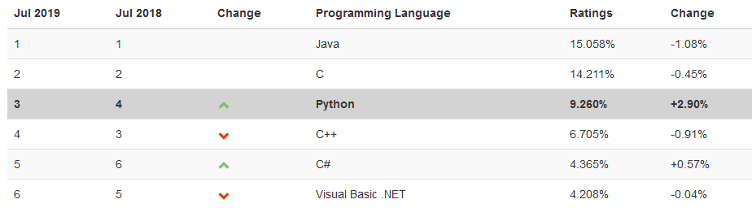

# Python fundamentals

Bienvenido a Python! Python es un lenguaje de programación de alto nivel, fácil de usar, versátil y potente. Es uno de los lenguajes más populares actualmente según el ínidce de TIOBE:



## Objetivo

Conocer la sintaxis básica de Python, variables y tipos de datos; operadores lógicos y condiciones, así como ciclos de control.

## Usos

Python tiene diversos campos de aplicación:
 - Aplicaciones web (Flask, Django...)
 - Aplicaciones multiplataforma (PyQt, TCL, click..)
 - Aplicaciones móviles (Kivy)
 - Electrónica, IOT (Micropython)
 - Data science (Tensorflow, Scipy...)
 - Robótica (ROS)

## Instalación
La instalación dependerá del sistema operativo que tengamos. Para este curso, cualquier versión superior a Python 3.4 es válida para seguirlo.

### Windows

Descargar el instalador de la última versión de Python 3 desde https://python.org, y seguir las instrucciones del instalador. También puedes descargar [Ubuntu para Windows 10](https://www.microsoft.com/es-mx/p/ubuntu/9nblggh4msv6), y así tener un sistema Linux en tu equipo, accesible desde Windows.

### Linux
Python 3 ya se encuentra disponible en la mayoría de distribuciones Linux. Basta con instalar la herramienta `pip`, que utilizaremos más adelante, mediante el comando el consola (Debian y Ubuntu): `sudo apt-get install python3-pip`.

### Mac OS X
Para Mac, la forma de instalación recomendada es mediante *Homebrew*, un gestor de paquetes para Mac. Seguir las instrucciones de instalación en https://brew.sh, y posteriormente correr el comando `brew install python3`.

Una vez que tengamos instalado Python, podemos revisar que esté instalado correctamente mediante el comando:
```bash
$ python3 -V
Python 3.6.8
```
Ahora estamos listos para correr nuestro primer programa en Python.

## ¿Python 2 o Python 3?

Cuando Python 3 salió al mundo, en 2008, tuvo una serie de cambios que lo hacían incompatible con código escrito de Python 2, así como librerías. Esto hizo que su nivel de adopción fuera bajo comparado con su antecesor. Esto fue cambiando gradualmente con el paso de los años.

Actualmente, se recomienda utilizar Python 3 para todo nuevo proyectos, Python 2 dejará de tener soporte para 2020. En proyectos con Python 2, se debe contemplar una estrategia para migrar a Python 3.

## Hola Mundo
El ejercicio primerizo por defecto, en cualquier lenguaje, es escribir Hola Mundo en nuestra pantalla. En Python, basta con crear un archivo con el siguiente contenido:
`hola_mundo.py`
```python
print("Hola Mundo!")
```
Y lo ejecutamos de la siguiente manera:
```bash
$ python3 hola_mundo.py
Hola Mundo!
```

## iPython

iPython es una consola interactiva de Python, con mas funcionalidades que la consola que trae por defecto. Para instalarla, corremos el comando:

```bash
$ pip3 install ipython
Collecting ipython
[...]
Successfully installed ipython
```
Y la abrimos con ipython3:

```
$ ipython3
Python 3.6.8 (default, Jan 14 2019, 11:02:34) 
Type 'copyright', 'credits' or 'license' for more information
IPython 7.6.1 -- An enhanced Interactive Python. Type '?' for help.

In [1]: import this                                                                                                                                                                                                                                   
The Zen of Python, by Tim Peters

Beautiful is better than ugly.
Explicit is better than implicit.
[...]
Namespaces are one honking great idea -- let's do more of those!

```