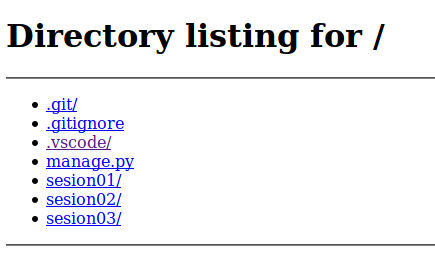

## Ejemplo 04

### Módulo HTTP Server

Ofrece funcionalidad como servidor HTTP.

`http-ejemplo.py`
```python
In [1]: import http.server

In [2]: http.server? 

Type:        module
String form: <module 'http.server' from '/usr/lib/python3.6/http/server.py'>
File:        /usr/lib/python3.6/http/server.py
Docstring:  
HTTP server classes.

Note: BaseHTTPRequestHandler doesn't implement any HTTP request; see
SimpleHTTPRequestHandler for simple implementations of GET, HEAD and POST,

In [4]: http.server.SimpleHTTPRequestHandler?  

Init signature: http.server.SimpleHTTPRequestHandler(request, client_address, server)
Docstring:     
Simple HTTP request handler with GET and HEAD commands.

This serves files from the current directory and any of its
subdirectories.  The MIME type for files is determined by
calling the .guess_type() method.

In [4]: exit()

$ python3 -m http.server

Serving HTTP on 0.0.0.0 port 8000 (http://0.0.0.0:8000/) 
```

Al acceder a http://0.0.0.0:8000/, se verá algo como esto:



### Módulo urllib

urllib es un paquete que contiene módulos centrados en abrir y leer herramientas.

`urllib-ejemplo.py`
```python
In [1]: import urllib

In [2]: urllib?  

Type:        module
String form: <module 'urllib' from '/usr/lib/python3.6/urllib/__init__.py'>
File:        /usr/lib/python3.6/urllib/__init__.py
Docstring:   <no docstring>

In [3]: from urllib import request 

In [4]: request?

Type:        module
String form: <module 'urllib.request' from '/usr/lib/python3.6/urllib/request.py'>
File:        /usr/lib/python3.6/urllib/request.py
Docstring:  
An extensible library for opening URLs using a variety of protocols

In [5]: r = request.urlopen("http://www.example.com")

In [6]: r.read()

Out[6]: b'<!doctype html>\n<html>\n<head>\n    <title>Example Domain</title>\n\n    <meta charset="utf-8" />\n    <meta http-equiv="Content-type" content="text/html; charset=utf-8" />\n    <meta name="viewport" content="width=device-width, initial-scale=1" />\n    <style type="text/css">\n    body {\n        background-color: #f0f0f2;\n        margin: 0;\n        padding: 0;\n        font-family: "Open Sans", "Helvetica Neue", Helvetica, Arial, sans-serif;\n        \n    }\n    div {\n        width: 600px;\n        margin: 5em auto;\n        padding: 50px;\n        background-color: #fff;\n        border-radius: 1em;\n    }\n    a:link, a:visited {\n        color: #38488f;\n        text-decoration: none;\n    }\n    @media (max-width: 700px) {\n        body {\n            background-color: #fff;\n        }\n        div {\n            width: auto;\n            margin: 0 auto;\n            border-radius: 0;\n            padding: 1em;\n        }\n    }\n    </style>    \n</head>\n\n<body>\n<div>\n    <h1>Example Domain</h1>\n    <p>This domain is established to be used for illustrative examples in documents. You may use this\n    domain in examples without prior coordination or asking for permission.</p>\n    <p><a href="http://www.iana.org/domains/example">More information...</a></p>\n</div>\n</body>\n</html>\n'

```