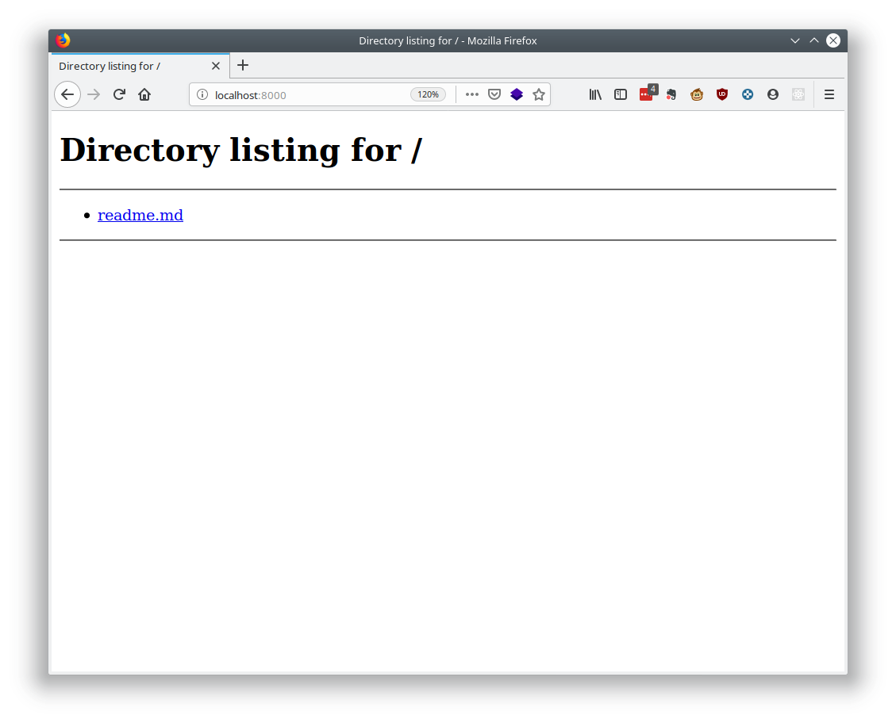

## Ejemplo 01

Python, con su filosofía de baterías incluidas, contiene un servidor básico de HTTP, el cual se puede utilizar para servir contenido.

`servidor.py`
```python
In [1]: # Importando o usando o incluyendo el módulo

In [2]: import http

In [3]: # Obteniendo ayuda del módulo

In [4]: http.server?
HTTP server classes.

Note: BaseHTTPRequestHandler doesn't implement any HTTP request; see
SimpleHTTPRequestHandler for simple implementations of GET, HEAD and POST,
and CGIHTTPRequestHandler for CGI scripts.
[...]

In [5]: # Obteniendo ayuda de la clase SimpleHTTPRequestHandler

In [6]: http.server.SimpleHTTPRequestHandler?
Init signature: http.server.SimpleHTTPRequestHandler(*args, directory=None, **kwargs)
Docstring:     
Simple HTTP request handler with GET and HEAD commands
```

Se puede iniciar el servidor web básico, sin necesidad de escribir código

```
$ python3 -m http.server
Serving HTTP on 0.0.0.0 port 8000 (http://0.0.0.0:8000/) ...
127.0.0.1 - - [12/Aug/2019 22:33:38] "GET / HTTP/1.1" 200 -
```



Ahí podemos colocar algún archivo index.html, que se mostrará por defecto.

`index.html`
