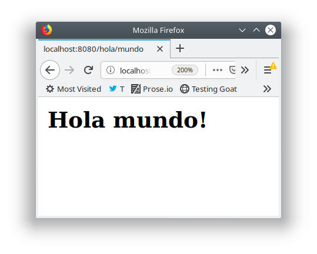
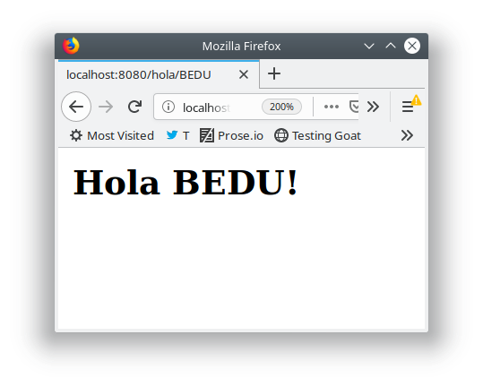
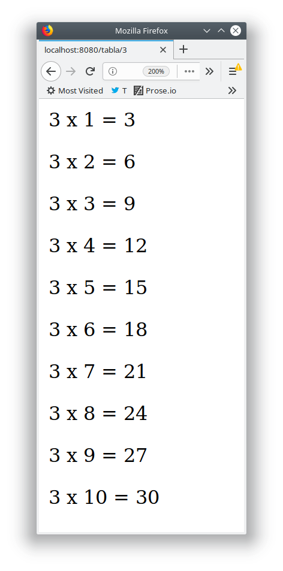

## Ejemplo 02
## Bottle.py

Bottle.py es un micro framework para crear aplicaciones web de forma sencilla, no tiene dependencias fuera de la librería estándar de Python y debido a que todo el framework vive en un solo script, se puede considerar portable.

### Instalación

Para su instalación, se puede descargar directamente de su sitio [bottle.py](https://bottlepy.org/bottle.py),o mediante pip:

`pip3 install bottle`

Como es portable, si se descargan se puede colocar en la misma carpeta que se encuentre el archivo/proyecto a correr.

`hola_bottle.py`

Utilizar el módulo bottle para mostrar un mensaje estilo "Hola Mundo!" en este caso, con un parámetro en su ruta que permita definir el nombre a utilizar en el saludo.

```
$ python3 hola-bottle.py 
Bottle v0.12.17 server starting up (using WSGIRefServer())...
Listening on http://localhost:8080/
Hit Ctrl-C to quit.
```




### Templates

En el ejemplo anterior, para mostrar contenido dinámico en la página, se utilizó la función `template` la cual puede insertar variables en el HTML, o ejecutar porciones de código incrustrado.

`tabla_html.py`

Generar la tabla de algún número utilizando la función template, y ejecutando código en la plantilla. Hacer uso de ciclos.


