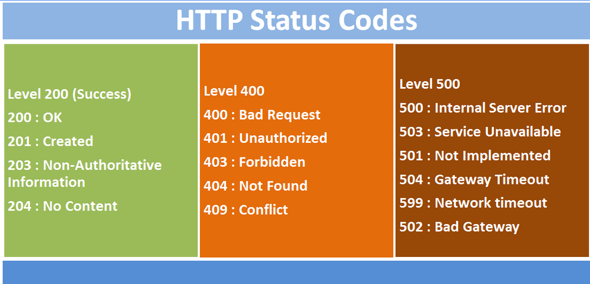

## Ejemplo 04
## Consumiendo información

Un API es una manera de interactuar con el servicio de un tercero, del cual normalmente se puede obtener, editar o agregar información. Las APIs pueden extender la funcionalidad de un programa. El término se asocia con APIs web, pero también existen para librerías o hardware.

Para obtener información de otras páginas o APIs, Python cuenta con la librería Requests, con la cual se puede hacer peticiones de una manera sencilla y rápida.

Para su instalación:
`pip install requests`

## Uso de Requests

`requests_demo.py`

Utilizar la API PokeAPI (http://pokeapi.co) con requests, para obtener información acerca de algún Pokemon.

```python
In [1]: import requests

In [2]: requests.get? # Ayuda                                                                                                                                    
Signature: requests.get(url, params=None, **kwargs)
Docstring:
Sends a GET request.

:param url: URL for the new :class:`Request` object.
:param params: (optional) Dictionary or bytes to be sent in the query string for the :class:`Request`.
:param \*\*kwargs: Optional arguments that ``request`` takes.
:return: :class:`Response <Response>` object
:rtype: requests.Response
File:      /usr/lib/python3/dist-packages/requests/api.py
Type:      function

In [3]: r = requests.get('https://pokeapi.co/api/v2/pokemon/pikachu/')

In [4]: r.status_code # Codigo para saber si la peticion fue exitosa  
Out[4]: 200

In [5]: pikachu = r.json() # Resultado obtenido 

In [6]: pikachu['weight']
Out[6]: 60
```

## Códigos de estado

Una Web API entrega códigos de estado para indicar el resultado de la operación realizada. Los tipos mas importantes son:

* 2xx: La petición fue relizada exitosamente
* 3xx: El recurso se ha movido
* 4xx: Error por parte del cliente
* 5xx: Error por parte del servidor



## Métodos HTTP

En una Web API, se utilizan los métodos o verbos HTTP para indicar el tipo de operación que se desa realizar.

Los más utilizados son:

* GET: Obtiene el recurso
* POST: Agrega un nuevo recurso
* PUT: Edita un recurso existente
* DELETE: Borra un recurso

`http_metodos.py`

```python
In [1]: import requests

In [2]: requests.get("https://jsonplaceholder.typicode.com/posts") # Obtener múltiples elementos
Out[2]: <Response [200]>

In [3]: requests.get("https://jsonplaceholder.typicode.com/posts/1") # Obtener un elemento
Out[3]: <Response [200]>

In [4]: requests.post("https://jsonplaceholder.typicode.com/posts", json={"post": "Nuevo post de ejemplo"}) # Nuevo elemento
Out[4]: <Response [201]>

In [5]: requests.put("https://jsonplaceholder.typicode.com/posts/1", json={"post": "Editado"}) # Editar elemento
Out[5]: <Response [404]>

In [12]: requests.delete("https://jsonplaceholder.typicode.com/posts/1")  # Borrar elemento
Out[12]: <Response [200]>

In [13]: requests.delete("https://jsonplaceholder.typicode.com/noexiste")  # Elemento no existente
Out[13]: <Response [404]>
````

