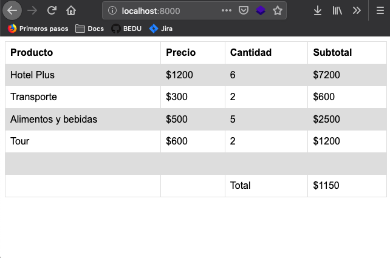

## Reto 02

`reservacion_html.py`
Mostrar con el servidor web, una tabla de reservación con información variable, obtenida a partir de un archivo CSV.
Modifica el archivo CSV para verificar su funcionamiento.

