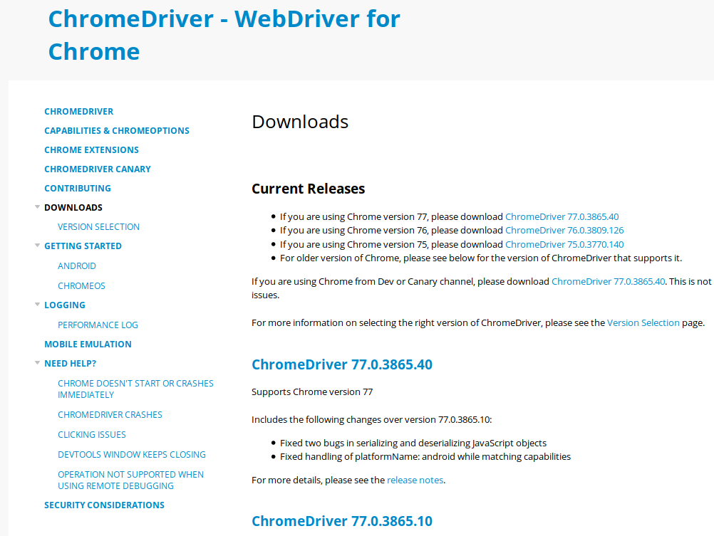

## Selenium

Existen página web en las cuales su contenido se obtiene a través de JS. Para obtener información de esas páginas, se puede utilizar Selenium, el cual es una librería que nos permite controlar un navegador completo.

Selenium es una librería extensa que se puede utilizar para pruebas con navegador, para esta sesión se limitará su uso básico en conjunto con Scrapy.

### Instalación

Para instalar la librería se tiene que correr el comando:

`pip install selenium`

Y un driver, que es el navegador a utilizar. Para este caso se utilizará Chrome.

[Chrome Web Driver](https://sites.google.com/a/chromium.org/chromedriver/downloads)


Descargar el driver que corresponde a la versión de Chrome instalada en el equipo.

Descomprimir su contenido y agregarlo al PATH.

### Uso

Para usar Selenium en un spider, se tiene que agregar la libería, y hacer unos cambios en un inicialización:

`spider_selenium.py`

```python
import scrapy
import csv
from selenium import webdriver

class Selenium(scrapy.Spider):
    name = 'selenium_spider'
    start_urls = [
        'https://www.example.com/'
    ]    

    def __init__(self):
        self.driver = webdriver.Chrome() # Driver de Selenium

    def start_requests(self):
        for url in self.start_urls:
            yield scrapy.Request(url=url, callback=self.parse)
```

Al correr este ejemplo, se abriría el navegador Chrome, para obtener los datos de la página.

### Ejemplo

`quotes_spider.py`

Crear un spider para obtener todas las citas de la página `http://quotes.toscrape.com/js/`, la cual requiere de JavaScript para mostrar su contenido.

