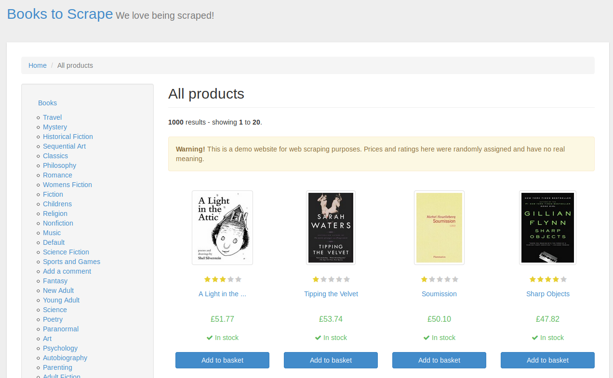

## Reto 01

## libros

`libros.py`

De la página web de http://books.toscrape.com/, utilizar Requests y BeautifulSoup para obtener una lista con el nombre de los libros y su precio, de su páigna principal.




```
Obteniendo libros. . .

-------------------------------------------------
|AUTOR                                   |PRECIO|
-------------------------------------------------
|A Light in the ...                      |£51.77|
|Tipping the Velvet                      |£53.74|
|Soumission                              |£50.10|
|Sharp Objects                           |£47.82|
|Sapiens: A Brief History ...            |£54.23|
|The Requiem Red                         |£22.65|
|The Dirty Little Secrets ...            |£33.34|
|The Coming Woman: A ...                 |£17.93|
|The Boys in the ...                     |£22.60|
|The Black Maria                         |£52.15|
|Starving Hearts (Triangular Trade ...   |£13.99|
|Shakespeare's Sonnets                   |£20.66|
|Set Me Free                             |£17.46|
|Scott Pilgrim's Precious Little ...     |£52.29|
|Rip it Up and ...                       |£35.02|
|Our Band Could Be ...                   |£57.25|
|Olio                                    |£23.88|
|Mesaerion: The Best Science ...         |£37.59|
|Libertarianism for Beginners            |£51.33|
|It's Only the Himalayas                 |£45.17|
-------------------------------------------------
```