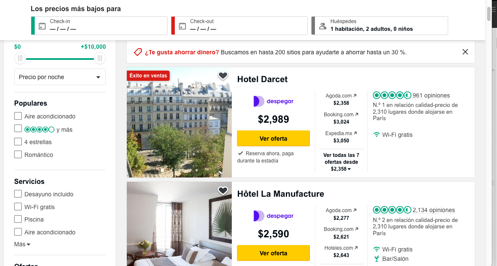

# Reto 02

`hoteles.py`

Obtener los precios por noche de un destino turístico a partir de alguna página de hoteles (por ejemplo: Trip Advisor). Descargar la página mediante el navegador primeramente si hace uso extensivo de Javascript. Utilizar funciones de búsqueda así como navegación.



```
$ python hoteles.py

Hoteles en Paris:
   * Hotel Darcet: $2,989
   * Hotel la Manufacture: $2,590
   * Hotel du Printemps: $2,431
   * Atlantic Hotel: $3,507
   [ ... ]
```
