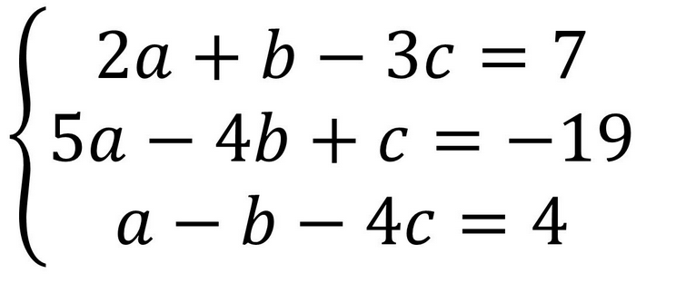

## Ejemplo 01

## Numpy

Numpy es la libería básica para realizar computación científica con Python. Su función más básica, es guardar y manipular arrays multidimensionales, de forma más rápida y sencilla que con listas de Python.

## Instalación

Para instalar numpy, basta con instalarlo mediante pip:

`pip install numpy`

Para verificar la versión instalada, hay que correr:

```python
>>> import numpy as np
>>> np.version.version
'1.17.1'
```

## Arrays en numpy

El array es la base de numpy. Se puede crear a partir de una lista o tupla, o a partir de sus diversas funciones para crear arrays.

`arrays_numpy.py`
```python
In [1]: # Creando un array con datos del 1 al 10

In [2]: import numpy as np

In [3]: np.arange(10)
Out[3]: array([0, 1, 2, 3, 4, 5, 6, 7, 8, 9])

In [4]: # Array de 3x3 con True

In [5]: np.full((3,3), True, dtype=bool)
Out[5]: 
array([[ True,  True,  True],
       [ True,  True,  True],
       [ True,  True,  True]])

In [6]: # Crear a partir de una lista

In [7]: lista = [1, 3, 5, 7, 9]

In [8]: np.array(lista)
Out[8]: array([1, 3, 5, 7, 9])
```

Los arrays pueden tener múltples dimensiones, y cambiarla a conveniencia, como se  verá a continuación:

`arrays_manipulacion.py`
```python
In [8]: # Cambiar forma de un array

In [9]: arr = np.arange(10)

In [10]: arr.reshape(2, -1)  # -1 define el las columnas en automatico
Out[10]: 
array([[0, 1, 2, 3, 4],
       [5, 6, 7, 8, 9]])

In [11]: # Invertir los contenidos de un array

In [12]: arr = np.arange(9).reshape(3,3)

In [13]: arr
Out[13]: 
array([[0, 1, 2],
       [3, 4, 5],
       [6, 7, 8]])

In [14]: arr[::-1]
Out[14]: 
array([[6, 7, 8],
       [3, 4, 5],
       [0, 1, 2]])

```

## Ejercicio: Sistema de ecuaciones

`ecuaciones.py`

Resolver un sistema de ecuaciones de 3x3 mediante el uso de Numpy. Crear un array con el sistema, y verificar la documentación, para utilizar el comando: `np.linalg.solve`. Verificar los resultados mediante el comando `np.allclose`



## Guardado y lectura de datos

Se puede guardar los arrays de Numpy en texto llano, o bien, como objetos binarios de Python

`save_load.py`

```python
In [1]: a = np.array([1, 2, 3, 4])

In [2]: np.savetxt('test1.txt', a, fmt='%d')

In [3]: b = np.loadtxt('test1.txt', dtype=int)

In [4]: a == b

Out[4]: array([ True,  True,  True,  True], dtype=bool)

In [8]: np.save("test.npy", a)  

In [9]: b = np.load("test.npy")

In [11]: a == b
Out[11]: array([ True,  True,  True,  True,  True])
```

La función `genfromtxt` puede obtener datos de un archivo local, una URL con un archivo, o una lista de los mismos.
