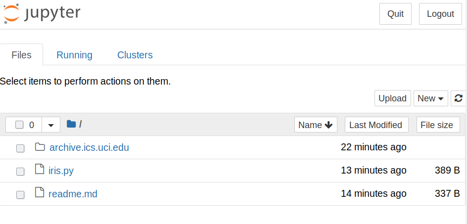
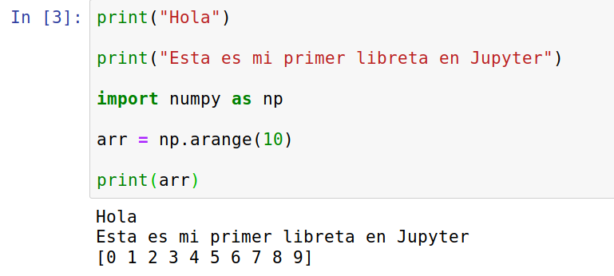
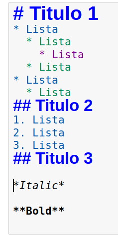

## Ejemplo 02

## Jupyter

Jupyter es una libreta dinámica de Python, utilizada ampliamente para realizar tareas de análisis de datos y computación científica. Puede integrar también imágenes y  gráficas.

### Instalación

Se instala mediante pip de la misma manera que otras librerías.

`pip install jupyter`

Para correr el entorno, se utiliza el comando: `jupyter notebook`

### Primeros pasos

Crear una libreta para comenzar a trabajar con Jupyter, con el comando New -> Python 3 Notebook.

El código de Python se puede correr con naturalidad. Presiona Ctrl+Enter o el botón Run para correr el código.

Para trabajar con texto, se seleciona Markdown, y se puede escribir texto en ese lenguaje:

