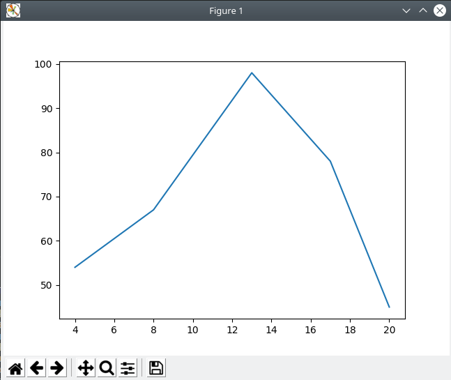
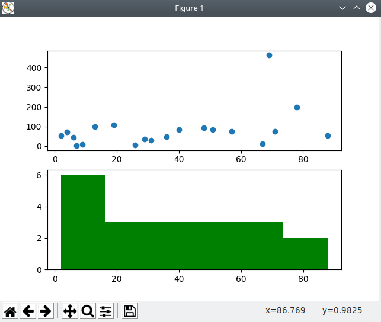
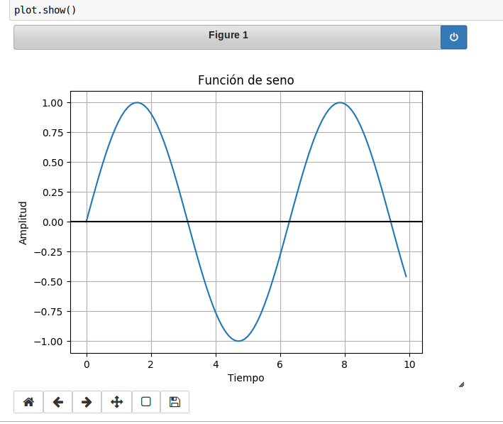

## Ejemplo 03

# Matplotlib

Matplotlib es una libería para generar gráficas en 2D. Puede utilizarse directamente con Python o bien, dentro de Notebooks de Jupyter.

## Instalación

Su instalación se hace mediante pip:

`pip install matplotlib`

## Gráfica de lineas

Generar una gráfica de líneas con 2 ejes: X y Y. Utilizar el comando `matplotlib.pyplot` para mostrar una gráfica interactiva.

`lineas.py`

## Subgráficas

Crear una gráfica de dispersión y un histograma en una misma ventana de gráfica.

`subgraficas.py`

## Uso en Jupyter

Para que matplotlib funcione con Jupyter, se necesita agregar una función *inline*, la cual permite definir su funcionamiento, estático o dinámico.

* `%matplotlib inline`: Entrega la gráfica como imagen estática
* `%matplotlib notebook`: Entrega una gráfica interactiva, pero sólo permite 1 a la vez.

`sinwave.ipynb`

Graficar la función seno en una libreta de Matplotlib. Probar con gráfica estática y dinámica.

