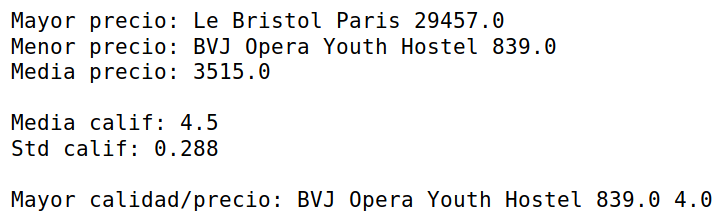

## Reto 02

Leyendo la información de hoteles obtenida en la sesión anterior en CSV, o utilizando el ejemplo `hoteles.csv`, crear una libreta de Jupyter en la cual se tenga información del:

* Precio mayor, precio menor y promedio de precios.
* Promedio y desviación estándar de calificación.
* Mejor hotel relación calificación/precio.

