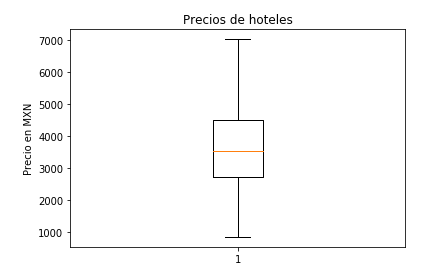

## Reto03

`precios_hoteles.ipynb`

Crear una libreta para mostrar con Matplotlib, los precios de los hoteles en un digrama de caja.
Dividir en 3 ejes la información de acuerdo al rango de precios.

